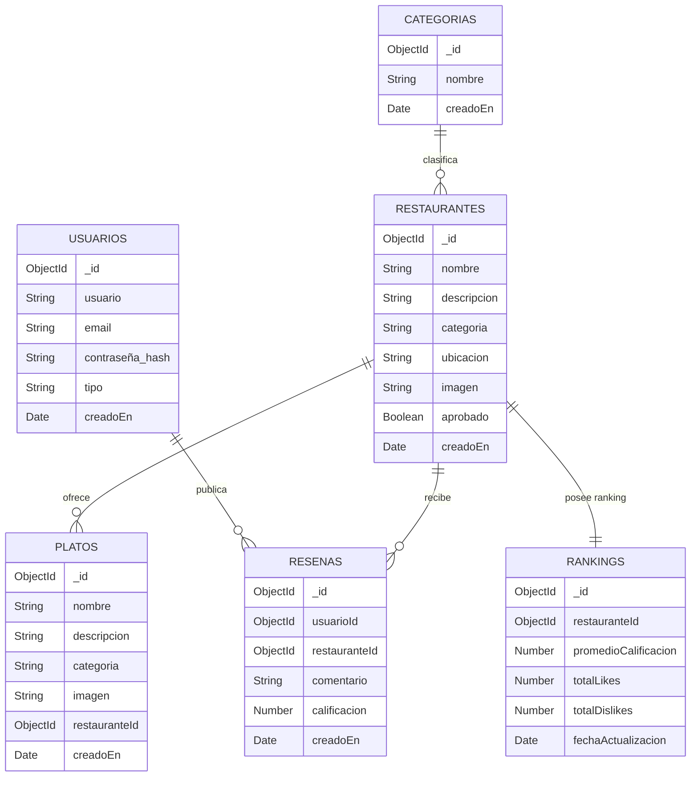

<!-- RANKING SYSTEM BACKEND README -->
<p align="center">
  
</p>

<h1 align="center">⚙️ RANKING SYSTEM — Backend</h1>

<p align="center">
  <b>API REST y servidor Node.js para la gestión de usuarios, restaurantes, reseñas y rankings gastronómicos.</b><br>
  Proyecto académico orientado a arquitectura REST, persistencia NoSQL y autenticación JWT.<br><br>
  <a href="https://github.com/Kevinlevin200/RANKING_SYSTEM_BACKEND">
    
  </a>
  <a href="https://github.com/Kevinlevin200/RANKING_SYSTEM_FRONTEND">
    
  </a>
  <a href="http://localhost:4000/api/v1/docs">
    
  </a>
</p>

---

## 🧭 Descripción General

El **Ranking System Backend** es el núcleo lógico y de datos del sistema de clasificación gastronómica.  
Su función es administrar usuarios, restaurantes, platos, reseñas y rankings, además de proporcionar una API REST completa y documentada.

> 🎓 Proyecto final académico — *Desarrollo de Aplicaciones Web*  
> Autor: **Kevin Levin**

---

## 🧠 Modelo de Datos (Mermaid ER Diagram)



---

## 🧩 Tecnologías Utilizadas

| Tecnología | Propósito |
|-------------|------------|
| **Node.js** | Entorno de ejecución de JavaScript en el servidor. |
| **Express.js** | Framework web para la creación de rutas y middlewares. |
| **MongoDB + Driver Nativo** | Base de datos NoSQL para la persistencia. |
| **bcrypt** | Encriptación segura de contraseñas. |
| **dotenv** | Manejo de variables de entorno. |
| **CORS** | Control de acceso entre dominios (Frontend ↔ Backend). |
| **Swagger UI** | Documentación interactiva de la API. |

---

## 🧱 Arquitectura del Proyecto

```
📂 RANKING_SYSTEM_BACKEND
 ├── 📁 config/         → Conexión a base de datos y variables de entorno
 ├── 📁 controllers/    → Lógica de negocio (usuarios, reseñas, ranking, etc.)
 ├── 📁 routes/         → Definición de endpoints REST
 ├── 📁 middlewares/    → Autenticación, validación y manejo de errores
 ├── 📁 dtos/           → Validación de entrada (Data Transfer Objects)
 ├── 📁 docs/           → Documentación Swagger
 ├── 📁 seed.js         → Script para poblar la base de datos
 ├── server.js          → Punto de entrada del servidor Express
 └── README.md
```

---

## 🌐 API REST — Rutas Principales

### 👤 Usuarios y Autenticación

| Método | Endpoint | Descripción | Seguridad |
|--------|-----------|-------------|------------|
| `POST` | `/api/v1/usuarios/registrar` | Registrar nuevo usuario o admin | Pública |
| `POST` | `/api/v1/usuarios/login` | Iniciar sesión (retorna JWT) | Pública |
| `GET`  | `/api/v1/usuarios/verificar-sesion` | Verificar sesión activa | JWT |
| `PATCH` | `/api/v1/usuarios/cambiar-contraseña` | Actualizar contraseña | JWT |

---

### 🍽️ Restaurantes y Platos

| Método | Endpoint | Descripción | Seguridad |
|--------|-----------|-------------|------------|
| `GET` | `/api/v1/restaurantes` | Listar todos los restaurantes | Pública |
| `GET` | `/api/v1/restaurantes/{id}` | Ver detalle de un restaurante | Pública |
| `POST` | `/api/v1/restaurantes/registrar` | Registrar restaurante | JWT |
| `PATCH` | `/api/v1/restaurantes/{id}` | Modificar restaurante | JWT |
| `DELETE` | `/api/v1/restaurantes/{id}` | Eliminar restaurante | JWT |
| `GET` | `/api/v1/platos/restaurante/{id}` | Listar platos de un restaurante | Pública |
| `POST` | `/api/v1/platos/registrar` | Registrar plato | JWT |

---

### ⭐ Reseñas e Interacciones

| Método | Endpoint | Descripción | Seguridad |
|--------|-----------|-------------|------------|
| `POST` | `/api/v1/resena/registrar` | Crear reseña | JWT |
| `GET` | `/api/v1/resena/usuario/{usuarioId}` | Reseñas del usuario | JWT |
| `POST` | `/api/v1/resena/{id}/like` | Dar “me gusta” | JWT |
| `POST` | `/api/v1/resena/{id}/dislike` | Dar “no me gusta” | JWT |

---

### 📊 Ranking y Categorías

| Método | Endpoint | Descripción | Seguridad |
|--------|-----------|-------------|------------|
| `GET` | `/api/v1/ranking/ranking` | Ranking general | Pública |
| `GET` | `/api/v1/ranking/categoria/{categoria}` | Ranking por categoría | Pública |
| `GET` | `/api/v1/ranking/detalle/{id}` | Vista detallada de restaurante | Pública |
| `POST` | `/api/v1/categoria/registrar` | Crear nueva categoría | JWT |
| `GET` | `/api/v1/categoria` | Listar categorías | Pública |

---

## ⚙️ Instalación y Ejecución Local

### 1️⃣ Requisitos

- Node.js 16+
- MongoDB local o remoto (Atlas)

### 2️⃣ Clonar el Repositorio

```bash
git clone https://github.com/Kevinlevin200/RANKING_SYSTEM_BACKEND.git
cd RANKING_SYSTEM_BACKEND
```

### 3️⃣ Instalar Dependencias

```bash
npm install
```

### 4️⃣ Configurar Variables de Entorno

Crea un archivo `.env` en la raíz con el siguiente contenido base:

```
PORT=4000
MONGODB_URI=mongodb://localhost:27017/ranking_db
JWT_SECRET=supersecreto123
RATE_LIMIT_WINDOW=15m
RATE_LIMIT_MAX=100
```

### 5️⃣ Poblar la Base de Datos

```bash
node seed.js
```

### 6️⃣ Iniciar el Servidor

```bash
npm run dev
```

> El backend estará disponible en  
> **http://localhost:4000/api/v1**

---

## 🔗 Integración con el Frontend

- Proyecto frontend: [RANKING_SYSTEM_FRONTEND](https://github.com/Kevinlevin200/RANKING_SYSTEM_FRONTEND)
- URL de comunicación: `http://localhost:4000/api/v1`
- Swagger UI disponible en `/api/v1/docs`
- Configurado para permitir CORS desde GitHub Pages y entornos locales

---

## 📚 Documentación Técnica

- **Swagger UI:** [http://localhost:4000/api/v1/docs](http://localhost:4000/api/v1/docs)
- **Estructura de Datos:** Basada en colecciones MongoDB
- **Autenticación:** JWT + middleware `verificarSesion`
- **Validación:** DTOs personalizados y `validationDTO`

---

## 🧠 Autores:

- juan camilo rojas arenas
- kevin santiago rivero rueda
- connie tatiana carrillo bohorquez
---

# video y documentacion:
[documentacion](https://drive.google.com/drive/folders/1CQ-_8IckDo3FDzcnoO-JkfSpnjThZm4M?usp=sharing)