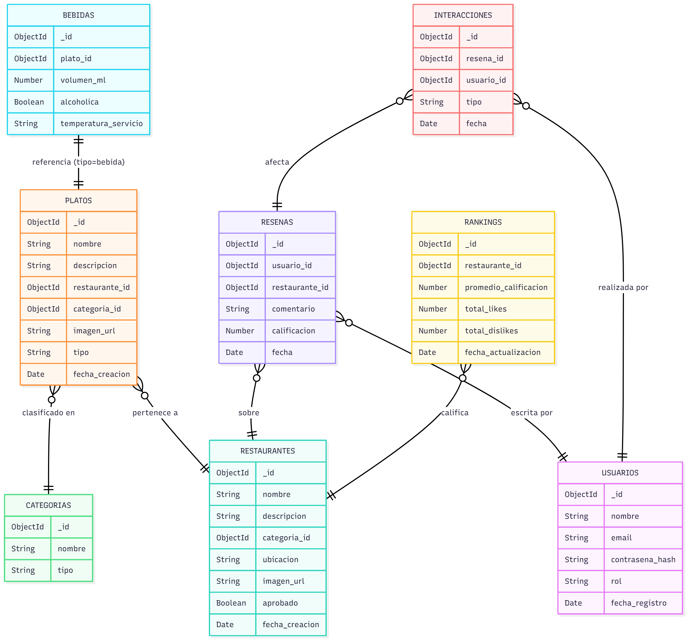

# RANKING_SYSTEM_BACKEND


erDiagram

    USUARIOS {
        ObjectId _id
        String nombre
        String email
        String contrasena_hash
        String rol
        Date fecha_registro
    }

    RESTAURANTES {
        ObjectId _id
        String nombre
        String descripcion
        ObjectId categoria_id
        String ubicacion
        String imagen_url
        Boolean aprobado
        Date fecha_creacion
    }

    PLATOS {
        ObjectId _id
        String nombre
        String descripcion
        ObjectId restaurante_id
        ObjectId categoria_id
        String imagen_url
        String tipo
        Date fecha_creacion
    }

    BEBIDAS {
        ObjectId _id
        ObjectId plato_id
        Number volumen_ml
        Boolean alcoholica
        String temperatura_servicio
    }

    CATEGORIAS {
        ObjectId _id
        String nombre
        String tipo
    }

    RESENAS {
        ObjectId _id
        ObjectId usuario_id
        ObjectId restaurante_id
        String comentario
        Number calificacion
        Date fecha
    }

    INTERACCIONES {
        ObjectId _id
        ObjectId resena_id
        ObjectId usuario_id
        String tipo
        Date fecha
    }

    RANKINGS {
        ObjectId _id
        ObjectId restaurante_id
        Number promedio_calificacion
        Number total_likes
        Number total_dislikes
        Date fecha_actualizacion
    }

    %% RELACIONES ENTRE COLECCIONES
    PLATOS }o--|| RESTAURANTES : "pertenece a"
    PLATOS }o--|| CATEGORIAS : "clasificado en"
    BEBIDAS ||--|| PLATOS : "referencia (tipo=bebida)"
    RESENAS }o--|| USUARIOS : "escrita por"
    RESENAS }o--|| RESTAURANTES : "sobre"
    INTERACCIONES }o--|| RESENAS : "afecta"
    INTERACCIONES }o--|| USUARIOS : "realizada por"
    RANKINGS }o--|| RESTAURANTES : "califica"


## Descripción del Proyecto

Este es el servicio de *backend* y la API REST para el **Sistema de Clasificación**. Es responsable de la persistencia de datos, la gestión de usuarios, restaurantes, reseñas, y el cálculo de la clasificación (`RANKINGS`).

El *backend* expone los *endpoints* necesarios para que el *frontend* consuma y manipule los datos de la aplicación.

## Tecnologías Utilizadas

  * **Node.js:** Entorno de ejecución de JavaScript del lado del servidor.
  * **Express.js:** Framework web para la gestión de rutas y *middleware*.
  * **MongoDB (o similar NoSQL):** Base de datos utilizada para la persistencia de datos (inferido por el uso de `ObjectId` en el esquema).
  * **JavaScript (ES6+):** Lenguaje de programación principal.

## Modelo de Datos

El sistema de clasificación se basa en un esquema de múltiples colecciones que gestionan usuarios, entidades a clasificar (restaurantes, platos) y las interacciones que influyen en el ranking.

**Relaciones clave:**

  * **USUARIOS** escriben **RESENAS**.
  * **RESENAS** son sobre **RESTAURANTES**.
  * **RANKINGS** se calculan a partir de la información de **RESTAURANTES**, **RESENAS** e **INTERACCIONES**.

## API Endpoints

La API opera sobre la ruta base `/api/` y expone los siguientes *endpoints* RESTful, que son los que consume el [RANKING\_SYSTEM\_FRONTEND](https://github.com/Kevinlevin200/RANKING_SYSTEM_FRONTEND):

### **Recurso Principal: `/api/ranking`**

| Método | Endpoint | Descripción | Conexión con Frontend |
| :--- | :--- | :--- | :--- |
| `GET` | `/api/ranking` | Obtiene la lista completa y ordenada de clasificaciones (Ranking). | **Listado principal.** |
| `GET` | `/api/ranking/:id` | Obtiene el detalle de la clasificación para un restaurante específico (por `restaurante_id`). | Vista de detalle. |
| `PUT` | `/api/ranking/:id` | Recalcula/Actualiza la métrica de clasificación para un restaurante. | Interacción (ej. dar *like* o *dislike*). |
| `DELETE` | `/api/ranking/:id` | Elimina una entrada de la tabla de clasificación. | Tarea administrativa. |

### **Otros Recursos Relevantes (CRUD)**

| Recurso | Método | Endpoint | Descripción |
| :--- | :--- | :--- | :--- |
| **Reseñas** | `POST` | `/api/resenas` | Crea una nueva reseña (que activará la actualización del Ranking). |
| **Reseñas** | `GET` | `/api/resenas/:restauranteId` | Lista todas las reseñas para un restaurante. |
| **Restaurantes** | `POST` | `/api/restaurantes` | Registra un nuevo restaurante en el sistema. |
| **Usuarios** | `POST` | `/api/auth/register` | Registro de nuevos usuarios. |

## Instalación y Ejecución Local

Sigue estos pasos para configurar y ejecutar el *backend* en tu máquina local.

### 1\. Requisitos

  * [Node.js](https://nodejs.org/) (versión 14 o superior)
  * [MongoDB](https://www.mongodb.com/try/download/community) (instancia local o conexión remota)

### 2\. Clonar el Repositorio

Abre tu terminal y clona el proyecto:

```bash
git clone https://github.com/Kevinlevin200/RANKING_SYSTEM_BACKEND.git
cd RANKING_SYSTEM_BACKEND
```

### 3\. Instalación de Dependencias

Instala los paquetes necesarios definidos en `package.json`:

```bash
npm install
```

### 4\. Configuración del Entorno (`.env`)

Crea un archivo llamado `.env` en la raíz del proyecto para gestionar las variables de entorno. Debes definir, al menos, la cadena de conexión a tu base de datos y el puerto de ejecución:

```
# Ejemplo de contenido para .env
PORT=3000
MONGODB_URI="mongodb://localhost:27017/ranking_db"
# OTRAS VARIABLES COMO JWT_SECRET, ETC.
```

### 5\. Ejecutar el Servidor

Inicia el servidor de Node.js:

```bash
npm start
# o, para desarrollo con reinicio automático:
npm run dev 
```

El *backend* estará operativo en la dirección y puerto que configuraste (ej. `http://localhost:3000`).

## Conexión con el Frontend

Para asegurar la correcta comunicación con el [RANKING\_SYSTEM\_FRONTEND](https://github.com/Kevinlevin200/RANKING_SYSTEM_FRONTEND):

1.  **CORS:** Asegúrate de que el *backend* tenga las cabeceras **CORS** (Cross-Origin Resource Sharing) configuradas para permitir solicitudes desde el origen donde se sirve el *frontend* (ej. `http://127.0.0.1:5500`).
2.  **Base URL:** El *frontend* debe apuntar a la base URL donde se ejecuta este *backend* (ej. si el *backend* está en el puerto 3000, las llamadas del *frontend* deben ir a `http://localhost:3000/api/ranking`).

## Licencia

(Añade aquí el tipo de licencia que deseas usar, por ejemplo: [MIT License](LICENSE.md))

-----